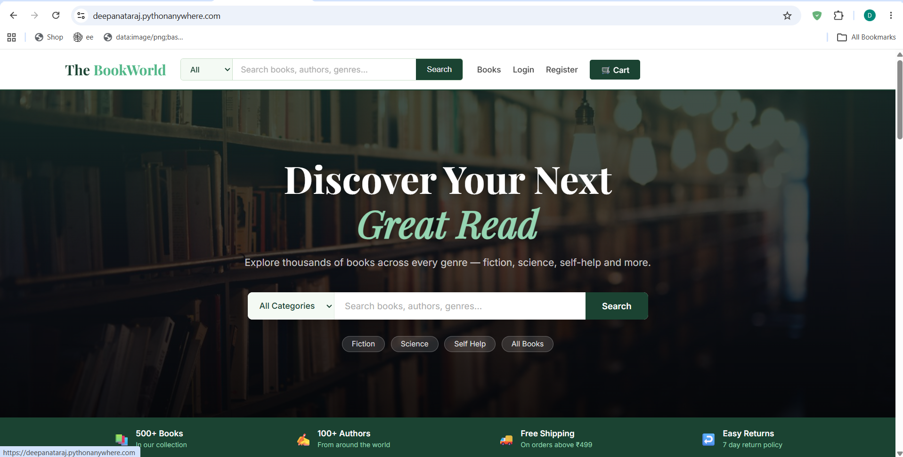
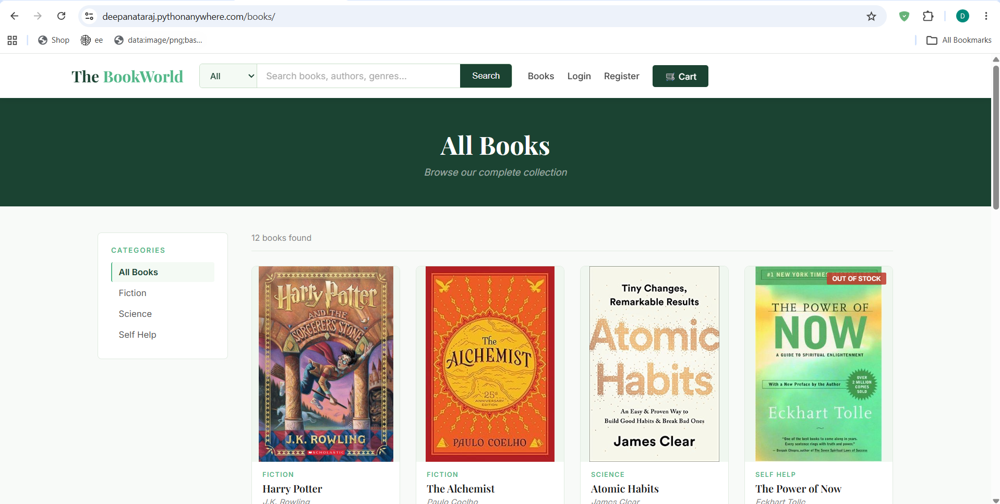
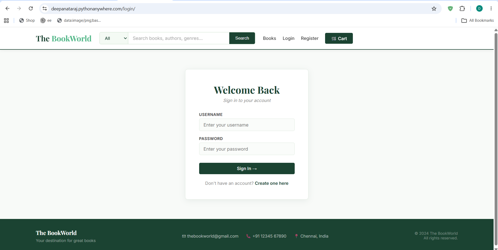
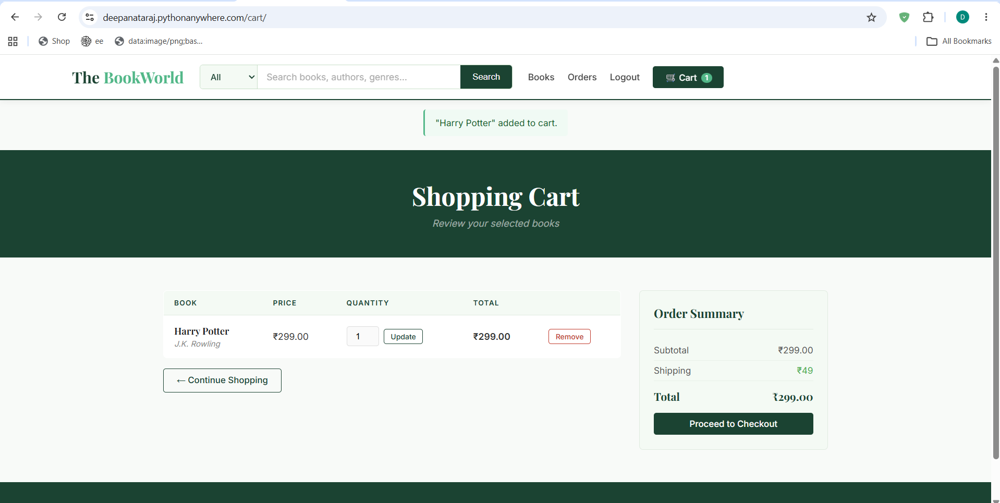

# 📚 The BookWorld

I built this as a full-stack e-commerce platform for buying books online — it was my way of learning how a real online store works under the hood, from browsing products to checkout.

🔗 **Live site:** https://deepanataraj.pythonanywhere.com

## What it does
You can browse books by category (Fiction, Science, Self Help), search by title or author, create an account, add books to your cart, and see your order total with shipping calculated in. Out-of-stock books are automatically marked as sold out.

## Built with
Django and Python for the backend, SQLite for the database, and HTML/CSS/JavaScript for the frontend. Deployed on PythonAnywhere.

## Screenshots

## Running it locally
git clone https://github.com/ThisisDeepaNataraj/Bookshop.git
cd Bookshop
pip install django
python manage.py runserver

---
Deepa Nataraj · [Portfolio](https://thisisdeepanataraj.github.io/PortfolioWebsite) · [LinkedIn](https://linkedin.com/in/deepa-nataraj-958170279)
